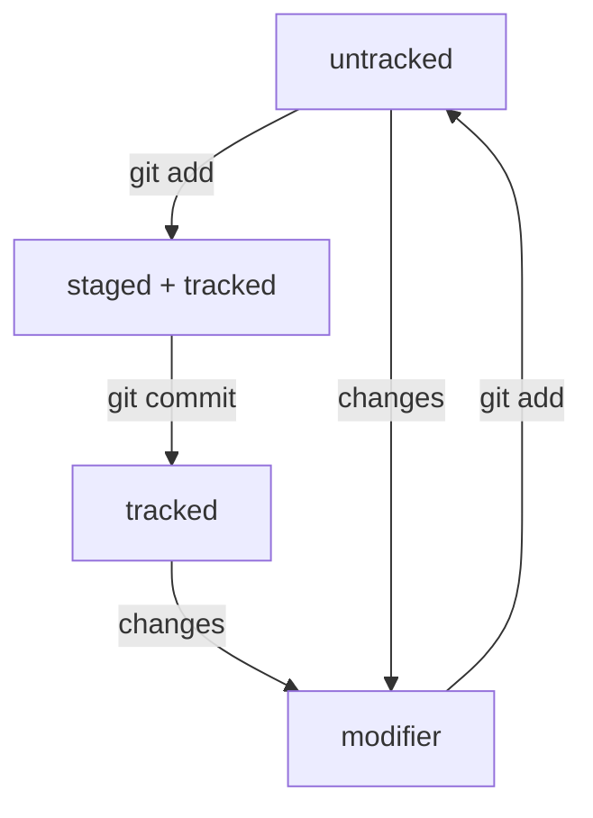

#It's Cheat sheet for Git Hub
---
##I made this only for myself

*I add to this file all information that i know, and of course i'll add new information every time.*

##This instuction uncliding ingo about 

1. Navigation
---
2. Work with folders and files
- creating
- copying and moving
- reading
- removal
---
3. Ssh key
- key search
- key generation
- key generation
---
4. HASH
- primary brand identifier for commit
- comands
- information
---
5. HEAD 
- place for hold
- information
---
6. Statuses folders in Git

%% Adjusting line styles %%
classDef thinLine stroke-width:1px,stroke-dasharray: 2,2;
class A thinLine;
class D thinLine;

